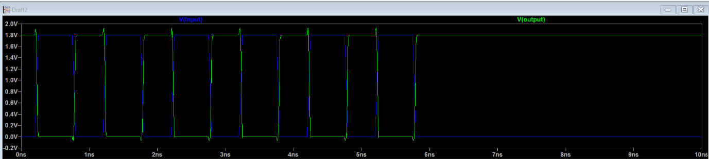
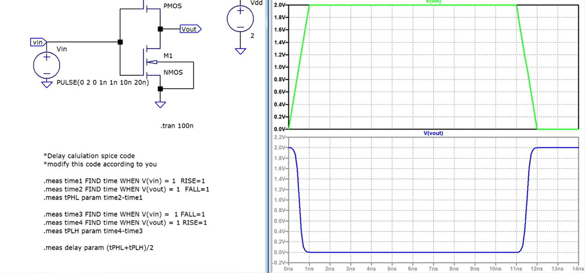
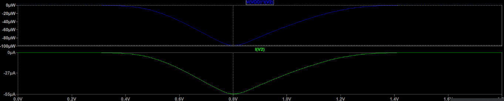
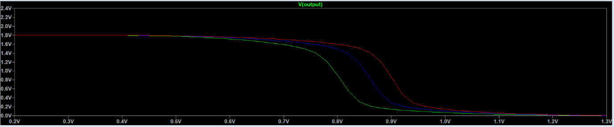

# CMOS Inverter Analysis using LTSpice

## 📌 Introduction
This project analyzes the **CMOS Inverter Circuit** using **LTSpice**, focusing on its **DC characteristics, delay, power dissipation, and noise margins**. Various simulations are performed, including:
- **DC Sweep Analysis**
- **Power Analysis**
- **Delay Calculation**
- **Voltage Transfer Characteristics (VTC)**
- **Effect of PMOS width (Wp) on inverter performance**

The goal is to **optimize transistor sizing** and **understand the switching behavior** of CMOS inverters.

---

## 📂 Project Structure

```
CMOS_Inverter_Analysis/
│── Library/
│   ├── cmosn.asy            # Custom NMOS symbol for LTSpice
│   ├── cmosp.asy            # Custom PMOS symbol for LTSpice
│   ├── tsmc018.lib          # TSMC 180nm MOSFET models
│
│── Reports/
│   ├── Characteristics_Of_CMOS_Inverter_Circuit.md
│   ├── CMOS_delay_detailed_analysis.md
│   ├── DC_Analysis_CMOS_Inverter.md
│   ├── DC_sweep_with_varying_Wp_analysis.md
│
│── Results/
│   ├── Characteristics_Of_CMOS_Inverter.png
│   ├── CMOS_delay_detailed_analysis.png
│   ├── DC_Analysis_CMOS_Inverter.png
│   ├── DC_sweep_with_varying_Wp_analysis.png
│
│── Schematics/
│   ├── CMOS_dc_power_analysis.asc          # LTSpice schematic for power analysis
│   ├── CMOS_inverter_dc_sweep.asc          # LTSpice schematic for DC sweep
│   ├── CMOS_Inverter.asc                    # Main CMOS inverter schematic
│
│── Scripts/
│   ├── plot_vtc.py                # Python script for plotting VTC curve
│   ├── analyze_power.py            # Script for analyzing power dissipation
│   ├── calculate_delay.py          # Script for extracting delay from LTSpice data
│
│── README.md                       # Project documentation
│── LICENSE                          # License file (if applicable)
│── .gitignore                        # Ignore unnecessary files (LTSpice backups, logs)
```

---

## 🚀 Getting Started

### 1️⃣ **Installation**
Ensure you have **LTSpice** installed. Download it from:
🔗 [LTSpice Download](https://www.analog.com/en/design-center/design-tools-and-calculators/ltspice-simulator.html)

**Optional:** If you want to analyze results using Python, install the required libraries:
```bash
pip install numpy matplotlib pandas
```

---

### 2️⃣ **Running LTSpice Simulations**
To run the simulations:
1. **Open LTSpice**.
2. Load the `.asc` files from the **Schematics/** directory.
3. Click **Run Simulation (⏯️ button)**.
4. Analyze the **VTC curves, power, and delay characteristics**.

---

## 📊 Simulation Details

### ✅ **1. DC Sweep Analysis (VTC)**
- **Schematic:** `CMOS_inverter_dc_sweep.asc`
- **Objective:** Plot the **Voltage Transfer Characteristics (VTC)**.
- **Key LTSpice commands:**
```spice
.dc V2 0 1.8 0.02
.include tsmc018.lib
```
- **Expected Output:**
  - **Vout vs Vin plot**
  - **Switching threshold calculation**

---

### ✅ **2. CMOS Delay Analysis**
- **Schematic:** `CMOS_Inverter.asc`
- **Objective:** Measure **propagation delay**.
- **Key LTSpice commands:**
```spice
.tran 10n
.include tsmc018.lib
```
- **Expected Output:**
  - **Rise-time & Fall-time measurements**
  - **tPLH, tPHL calculations**

---

### ✅ **3. Power Dissipation Analysis**
- **Schematic:** `CMOS_dc_power_analysis.asc`
- **Objective:** Measure **short-circuit and static power dissipation**.
- **Key LTSpice commands:**
```spice
.meas DC SCPOWER FIND V(VDD)*I(V2) AT 0.8
.meas DC SSPOWER FIND V(VDD)*I(V2) AT 0
.include tsmc018.lib
```
- **Expected Output:**
  - **Power dissipation values for different inputs**.

---

### ✅ **4. Effect of PMOS Width (Wp)**
- **Schematic:** `DC_sweep_with_varying_Wp_analysis.asc`
- **Objective:** Study how **PMOS width (Wp)** affects inverter behavior.
- **Key LTSpice commands:**
```spice
.step param Wp 800n 1600n 400n
.dc V2 0 1.8 0.02
.include tsmc018.lib
```
- **Expected Output:**
  - **VTC curve for different Wp values**
  - **Effect on noise margins & power dissipation**

---

## 📜 Results & Analysis
📁 **Find all simulation results in the `Results/` directory.**  
Each `.png` file represents the graph generated from the corresponding `.asc` schematic.

| Analysis | Image |
|----------|-----------------------------|
| **VTC Characteristics** |  |
| **CMOS Delay Analysis** |  |
| **DC Sweep Analysis** |  |
| **Effect of Wp** |  |

---

## ⚡ Automating Analysis with Python
For post-processing LTSpice results, use the Python scripts in `Scripts/`:
1. **VTC Plotting**:
   ```bash
   python plot_vtc.py
   ```
2. **Power Analysis**:
   ```bash
   python analyze_power.py
   ```
3. **Delay Calculation**:
   ```bash
   python calculate_delay.py
   ```

These scripts process LTSpice data (`.raw` files) and generate **graphs & reports**.

---

## 🎯 Conclusion
- **This project provides an in-depth CMOS inverter analysis**.
- **Transistor sizing significantly affects delay, power, and noise margins**.
- **Optimizing PMOS width (Wp) is key for balancing noise margins**.
- **LTSpice + Python can automate and enhance circuit analysis**.

---